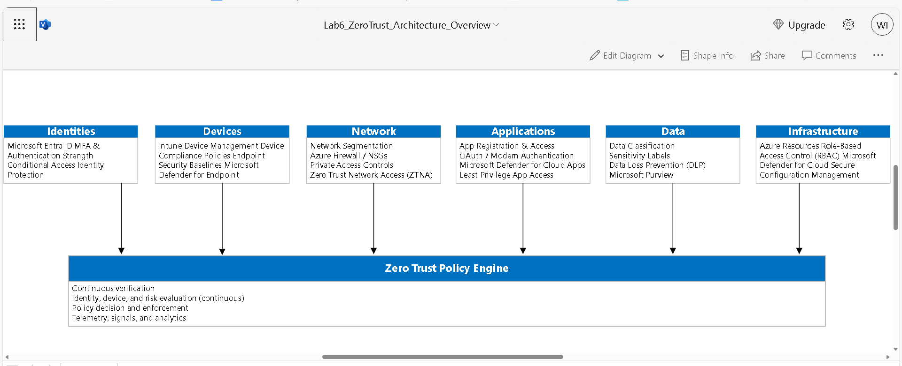

# Lab 06 – Zero Trust Architecture (Capstone)

## Objective
Design and document a comprehensive Zero Trust security architecture that integrates identity, device, application, and data protection controls implemented across Labs 01–05.

This capstone demonstrates how individual Zero Trust controls work together as a unified security model rather than isolated configurations.

---

## Zero Trust Principles
- Verify explicitly  
- Use least privilege access  
- Assume breach  

This architecture removes implicit trust and continuously evaluates access based on identity, device health, application context, and data sensitivity.

---

## Architecture Overview
The Zero Trust architecture is built around **identity as the control plane**, with enforcement decisions driven by Conditional Access, device compliance, application protection, and data classification.

Access is granted only when **all required trust signals are satisfied**.

---

## Zero Trust Pillars and Implementation Mapping

### Identity (Lab 01)
- Enforced Multi-Factor Authentication (MFA)
- Implemented authentication strength requirements
- Applied Conditional Access policies based on sign-in risk
- Validated policies prior to enforcement

Identity serves as the **primary enforcement point** for all access decisions.

---

### Devices (Lab 02)
- Enrolled and managed endpoints using Microsoft Intune
- Enforced device compliance and security baselines
- Integrated Microsoft Defender for Endpoint risk signals
- Blocked access from non-compliant or high-risk devices

Only trusted and healthy devices are permitted to access resources.

---

### Policy Validation and Monitoring (Lab 03)
- Deployed Conditional Access policies in Report-only mode
- Evaluated real sign-in behavior and policy impact
- Reduced risk of user lockout during policy rollout

This ensured policies were validated before enforcement, aligning with Zero Trust operational best practices.

---

### Applications (Lab 04)
- Secured cloud applications using modern authentication
- Removed reliance on legacy authentication methods
- Applied Conditional Access to enforce authentication before authorization
- Implemented least privilege application access

Applications are protected independently of network location.

---

### Data (Lab 05)
- Established sensitivity labeling for data classification
- Implemented Data Loss Prevention (DLP) policies
- Validated policy scope and enforcement readiness
- Ensured data protection across Microsoft 365 workloads

Data remains protected regardless of user, device, or access method.

---

## Zero Trust Policy Flow

1. User attempts access to a cloud application
2. Identity is authenticated using MFA and authentication strength
3. Device compliance and risk posture are evaluated
4. Conditional Access policies assess contextual risk
5. Application access is authorized based on least privilege
6. Data access is monitored and protected using DLP

Access is granted **only if all conditions are met**.

---

## Outcome
This capstone demonstrates the ability to:
- Design a complete Zero Trust security architecture
- Integrate multiple security controls into a unified model
- Apply Zero Trust principles across identity, device, application, and data layers
- Validate and document security controls using enterprise best practices

---

## Skills Demonstrated
- Zero Trust architecture design
- Microsoft Entra ID security controls
- Conditional Access strategy
- Endpoint and application security
- Data protection and DLP
- Security validation and monitoring

---

## Zero Trust Architecture Overview

The following diagram represents the unified Zero Trust architecture implemented across Labs 01–05.  
Each security pillar feeds continuous signals into a centralized Zero Trust policy engine responsible for verification, decision-making, and enforcement.

This architecture demonstrates how identity, device posture, network controls, application access, data protection, and infrastructure security operate as a single security model rather than isolated controls.

## Portfolio Summary
This project demonstrates an end-to-end Zero Trust implementation using Microsoft cloud security technologies. Each lab represents a security pillar, and this capstone shows how they function together as a cohesive architecture.

This approach mirrors real-world enterprise Zero Trust deployments and security engineering practices.

